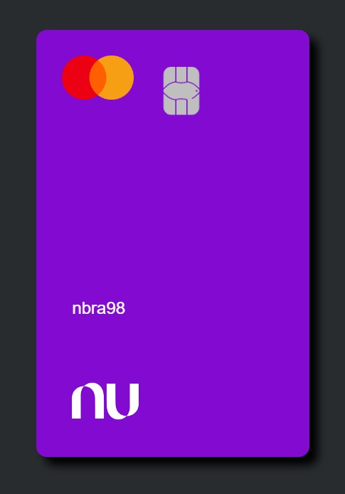

<h1 align="center">Cartão Animado Nubank 💳</h1>

<h2 align="center">Meu 4º Projeto em Desenvolvimento Front-End ​​💻​​</h2> 

 

<h2 align="center">Sobre 📑</h2>

Réplica do cartão do Nubank com animação construída em JavaScript.
 

<h2 align="center">Tecnologias ​👨🏻‍💻​</h2>

HTML - CSS - JavaScript 
 

<h2 align="center">Para acessar ​🔗️</h2>

<a href="https://​nbra98.github.io/cartao-animado-nubank/">Clique aqui</a>
  

